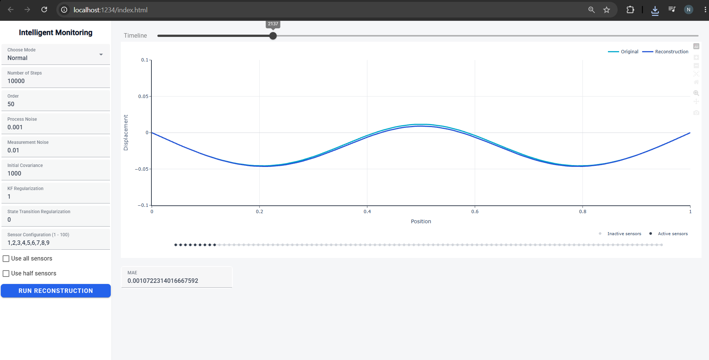
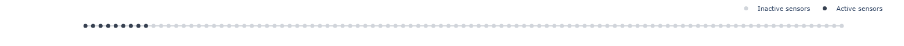
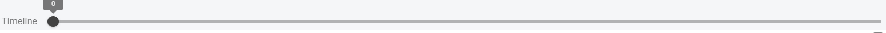
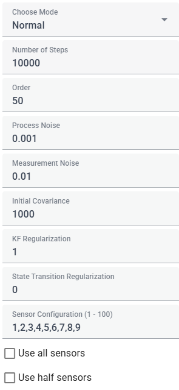
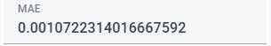

# Intelligent Monitoring Dashboard
This is an interactive dashboard for monitoring and reconstructing powerline vibrations using sparse sensor measurements and Dynamic Mode Decompostion (DMD).
This dashboard is built with **Trame**, **Plotly** and **Python**.

## Features
### Vibration Reconstruction

Compare the original powerline displacement field against the DMD reconstruction interactively.

### Sensor Configuration

Configure the available sensors and visualize active and inactive sensor locations directly on the powerline.

### Interactive Timeline

Move through the reconstructed time history using the timeline control.

### Parameters
<br>
Change different parameters in the algorithm and see their effect on the reconstruction.

### Reconstruction Error
<br>
Monitor reconstuction performance using metrics such as Mean Absolute Error (MAE).

**Note**: Use the **Run Reconstruction** button to reconstruct the powerline after changing parameters.

## Data
The vibration datasets used by this dashboard are hosted on **Zenodo** and are not included directly in this repository.

Download the required datasets from:
- **Baseline powerline case**: [101_points.csv](https://zenodo.org/records/19581918/files/101_points.csv?download=1)
- **Mass-at-midspan case**: [m_10_L_2.csv](https://zenodo.org/records/19581918/files/m_10_L_2.csv?download=1)

After downloading the data, place the files in ```data/```.

```text
|
├── app.py
├── dashbaord/
├── model/
├── data/
	├── 101_points.csv
	├── ...
├── requirements.txt
├── README.md
```

The dashboard expects the dataset files to be available locally in the ```data/``` directory.

## Installation
Clone this repository:

```bash
git clone https://github.com/Nambiar99/Inteliigent-Monitoring-Dashboard.git
```

Create a virtual environment:

```bash
python -m venv .venv
```

Activate it on Windows:

```bash
/venv\Scripts\activate
```

Install dependencies:

```bash
pip install -r requirements.txt
```

## Running the Dashboard

```bash
python app.py
```

Then open ```http://localhost:1234```

To use a different port, change it here:

<pre><a href="/dashboard/app.py#L112"><code># Change this line in /dashboard/app.py:
server.start(port=1234)</code></a></pre>

## Project Context
The inner workings of this dashboard are based on research conduducted as part of my MS Thesis at **Virginia Polytechnic and State University** titled, "**Intelligent Monitoring of Powerline Vibrations Using Sparse Sensors and Predictive Modeling**". 
The original research investigates how sparse measurements can be used to reconstruct the vibration response of a powerline using data-driven modeling and state estimation. The research also dives into different methods of data-driven methodology including Deep Learning based methods and also discusses fail-safe mechanisms incase of data loss.

**MS Thesis**: [Thesis](https://hdl.handle.net/10919/134301)<br>
**Conference Paper**: [Paper](https://doi.org/10.1115/DETC2024-146264)